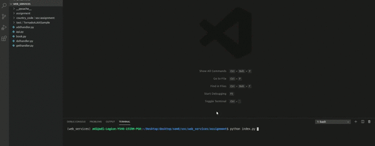

# CoCo-Corona-Counter
**CoCo**: A micro-service powered "Corona Counter" built using Tornado. Simply enter a country's name, and you shall get the number of cases for the country in terms of "Active", "Recovered" and "Dead".

---

# CoCo in Action

---

# Quick Start

Make sure you install tornado, urllib and lxml. I used the following versions:
- tornado 3.2.1
- urllib3 1.25.8
- lxml 4.5.0
- python 3.6

Once that's done, the following steps should get you up and running

1. Run the app.py file
`./app.py`
2. Open up your browser to `localhost:8888`

---

# Accompanying Blog Post

Feel free to check out my [blog post](https://www.narcodes.org/coco/) where I explain the code in more detail. This will hopefully give you more intuition as to how the python tornado library works.

---

# Architecture Overview
Tornado's orchestration of web-services under CoCo's hood is illustrated in the following flowchart.

---
