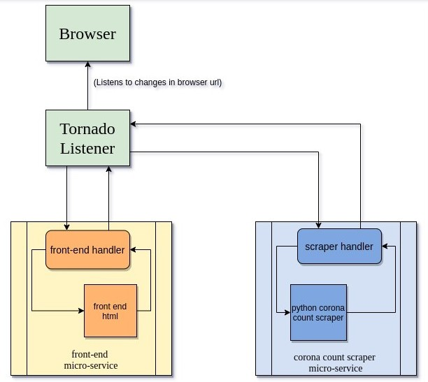

# CoCo-Corona-Counter
CoCo: A micro-service powered Corona Counter build using Tornado

## Architecture Overview
Tornado's orchestration of web-services under CoCo's hood is illustrated in the following flowchart.

